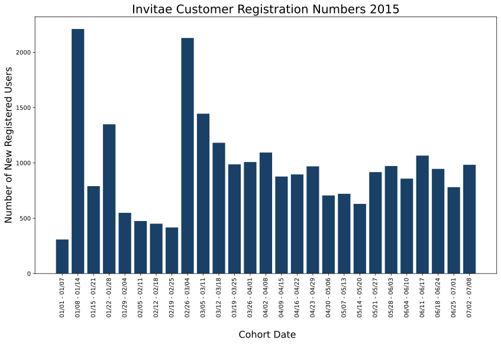
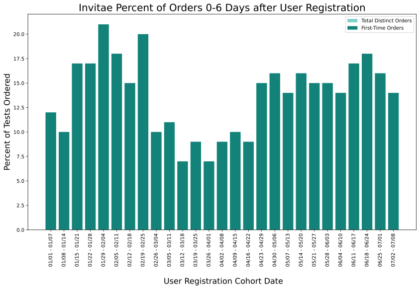
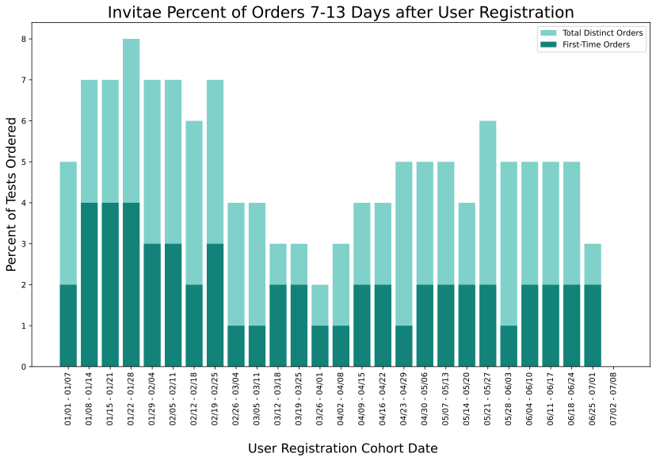

# Invitae - Cohort Analysis
### Applicant - Samantha Buck
-------------------------------------
#### Objective
**Goal** 
We would like to perform a cohort analysis on our customers to help identify changes in ordering behavior based on their signup date.  
> Using the two CSV files: customers.csv and orders.csv

For this exercise group the customers into week long (7 days) cohorts and then calculate how many distinct customers ordered within X days from their signup date, where X is a multiple of 7. Older cohorts will have more buckets: 0-6 days, 7-13 days, 14-20 days, etc.   

----------------------------  
#### Methods
**Import Data, Check Cleanliness, Understanding Features**
1. Import both csv files
2. Change any date columns to DateTime
3. Understand Features:
    - In the *Customers* csv, ```id``` will match ```user_id``` in the *Orders* csv and ```created``` is the date + time the customer was created in the system.
    - In the *Orders* csv, ```order_number``` is the number in the system for the order compared to ```id``` which is the order number for the specific user (1st order, 2nd order, etc.), and ```created``` is the date + time the order was created in the system.

**Merge Data + Create Cohorts**
1. Merge the *Customers* and *Orders* dataframes with an outer join to retain all customers even if they have not ordered yet.
2. Re-index the dataframe with a DateTime Period Index for each 7-day cohort; now each row is labeled with an index of the cohort to which they belong.
3. Create new feature that calculates the time between the user creation and the order creation.

|                       | customer_id | customer_created    | order_id | order_number | order_created       | time_to_order   | Order_Group_days |
|-----------------------|-------------|---------------------|----------|--------------|---------------------|-----------------|------------------|
| date_index            |             |                     |          |              |                     |                 |                  |
| 2015-07-02/2015-07-08 | 35410.0     | 2015-07-03 22:01:11 | NaN      | NaN          | NaT                 | NaT             | NaN              |
| 2015-07-02/2015-07-08 | 35417.0     | 2015-07-03 22:11:23 | NaN      | NaN          | NaT                 | NaT             | NaN              |
| 2015-07-02/2015-07-08 | 35412.0     | 2015-07-03 22:02:52 | NaN      | NaN          | NaT                 | NaT             | NaN              |
| 2015-07-02/2015-07-08 | 35413.0     | 2015-07-03 22:05:02 | NaN      | NaN          | NaT                 | NaT             | NaN              |
| 2015-07-02/2015-07-08 | 35424.0     | 2015-07-03 22:21:55 | 27970.0  | 1.0          | 2015-07-03 23:37:49 | 0 days 01:15:54 | 0.0              |
| ...                   | ...         | ...                 | ...      | ...          | ...                 | ...             | ...              |
| NaT                   | NaN         | NaT                 | 1504.0   | 1.0          | 2014-10-20 18:41:01 | NaT             | NaN              |
| NaT                   | NaN         | NaT                 | 1570.0   | 2.0          | 2014-10-22 02:50:21 | NaT             | NaN              |
| NaT                   | NaN         | NaT                 | 1387.0   | 1.0          | 2014-10-14 19:40:57 | NaT             | NaN              |
| NaT                   | NaN         | NaT                 | 1398.0   | 1.0          | 2014-10-14 21:49:05 | NaT             | NaN              |
| NaT                   | NaN         | NaT                 | 1394.0   | 1.0          | 2014-10-14 20:56:12 | NaT             | NaN              |  

**Gather Data + Statistics for 7-Day Periods of Time**
1. Create a dictionary for the 7-day periods.
2. Create lists of the number of first-time orders and overall distinct customer orders for each cohort in each 7-Day period.
3. Create a list of the number of distinct customers total per cohort.
4. Calculate the percentage of orderers and first-time orders per cohort for each 7-day time period.

**Create New Dataframe**
1. Create a new dataframe with the columns: ```Cohort```, ```Customers```, ```0-6 Day```, ```7-13 Days```, ... and so on for each of the 7-Day time periods.
2. Each row is a distinct cohort listing the number of customers who registered during that time, the number/perfecntage of orderers for each 7-day period, and the number of first-time orders for each 7-day period. 
3. Clean up the dataframe and save to a csv file.

|   | Cohort        | Customers | 0-6 Days                               | 7-13 Days                          | 14-20 Days                         |
|---|---------------|-----------|----------------------------------------|------------------------------------|------------------------------------|
| 0 | 07/02 - 07/08 | 983.0     | 14% orderers(136), 14% first-time(136) |                                    |                                    |
| 1 | 06/25 - 07/01 | 781.0     | 16% orderers(123), 16% first-time(123) | 3% orderers(23), 2% first-time(12) |                                    |
| 2 | 06/18 - 06/24 | 946.0     | 18% orderers(168), 18% first-time(168) | 5% orderers(44), 2% first-time(16) | 2% orderers(15), 0% first-time(3)  |
| 3 | 06/11 - 06/17 | 1066.0    | 17% orderers(177), 17% first-time(177) | 5% orderers(51), 2% first-time(18) | 4% orderers(46), 1% first-time(11) |
| 4 | 06/04 - 06/10 | 858.0     | 14% orderers(121), 14% first-time(121) | 5% orderers(39), 2% first-time(19) | 4% orderers(37), 1% first-time(8)  |
| 5 | 05/28 - 06/03 | 972.0     | 15% orderers(148), 15% first-time(148) | 5% orderers(48), 1% first-time(12) | 5% orderers(48), 2% first-time(18) |
| 6 | 05/21 - 05/27 | 917.0     | 15% orderers(140), 15% first-time(140) | 6% orderers(52), 2% first-time(22) | 5% orderers(47), 1% first-time(11) |
| 7 | 05/14 - 05/20 | 630.0     | 16% orderers(99), 16% first-time(100)  | 4% orderers(27), 2% first-time(12) | 5% orderers(33), 1% first-time(9)  |
| 8 | 05/07 - 05/13 | 721.0     | 14% orderers(102), 14% first-time(102) | 5% orderers(39), 2% first-time(17) | 4% orderers(27), 1% first-time(4)  |
| 9 | 04/30 - 05/06 | 706.0     | 16% orderers(115), 16% first-time(115) | 5% orderers(35), 2% first-time(13) | 5% orderers(32), 1% first-time(6)  |  

----------------------------  
#### Analysis

If we look at the number of new registered users over the 27 cohorts between January 1, 2015 and July 8, 2015, we can see some spikes in registration around New Year's, the end of January and early March; along with a steady stream of registrations over the late spring/early summer months. 

  

If we look more closely at each the days following each cohort's initial user registration period, we can see in 0-6 days all orders are first-time orders for new users. As well as, the proportion of tests ordered out of total registered users from that cohort in the first 7 days varies between 7.5-22%.  

  

When we look at the next time frame of 7-13 days after a user has registered with the system, there are still quite a few first time orders (1-4% of orderers); however, there are also quite a few orders from existing customers whose first order was placed in the 0-6 day timeframe.  

  

----------------------

Thank you for your time and this opportunity.<br>
Sincerely,<br>
Samantha Buck<br>
[My Resume](Samantha_Buck_Resume.pdf)